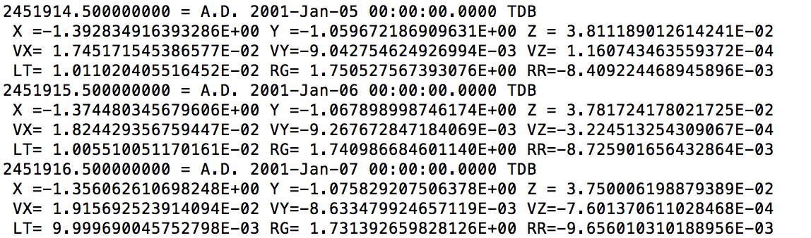

# Final_Projects_Su2020:  Auralizing data from the JPL Horizon Database using Probe_Vector_Auralization.py

This is an algorithm that takes a text file of an output from the Jet Propulsion Lab Horizons Database.  
Horizons is a publicly available database of various readings from probes, generally rotating around a particular body.  The nature of the output data can be specified by querying specific parameters in a telnet interface you use to access the data.  
The ultimate goal of this project is to generate a single period of a "waveform" caused by the oscillations along the X Y and Z planes to later be used in a more complex naturalization of brainwave data, however, I was excited to discover that python has its own library to deal with audio files called the wave library.  I decided from that to explore direct auralization within python as an educational project.  If you find it interesting, please take a look under the hood.  

# getting a dataset from JPL Horizons
The first step is to create a dataset form Horizons [here](https://ssd.jpl.nasa.gov/?horizons#telnet)

Once you arrive there you can click the link to open the Horizons telnet portal in a terminal window or command prompt.

the welcome page should look something like this:

You can open the telnet portal directly by clicking [here](telnet://horizons.jpl.nasa.gov:6775)

From here you can either browse the site for available datasets by typing "lb" or "sb" at the prompt
and then searching from there, or if you know the name of the dataset you are looking for you can type its name. 

If right now this algorithm only accepts vector data from the craft.  The reason for this is that vector data of different probes tends to oscillate in a periodic fashion.  As this algorithm is concerned with using the data to directly create audio waveforms, such periodic oscillation data is the most desirable.  Other types of data may be interpreted and auralized in future, but for the scope of this project we are focusing on vector data. 

For whatever dataset you decide to use, the prompts after searching for the specific craft are as follows

3 [enter] (Ephemeris) 

v [enter] (vectors)

[enter],

e [enter] (eclip)

[enter],  (or set begin date)

[Enter],  (or set end date)

[Enter],  (or set time interval)

[Enter], accept the default output parameters

After you do this, it will generate a dataset that you can then copy and paste into a text doc and name as you like.  Simply put the text file in the repository with Phobos Auralizaiton.py and you are ready to run the program.  Take a look at the current text files in the repository "Phobos2018-Jan-02.txt" and "ParkerSolarProbe.txt" and make sure the formatting seems to match.  Even if the specific data points in the three rows are different, as long as the formatting is precisely the same, Phobos Auralization.py will be able to read the file.  

# Understanding the Dataset

to run the program, you need to make sure you understand the dataset itself.  

The periodic measurements in the dataset are formatted like so:

Each measurement starts with a timestamp, followed by the data and time.
This is followed by 3 rows of data.  The first two rows are 3 position and vector data respectively while the 3rd represents other aspects of motion. We are mostly here concerned with the first two but a curious user is welcome to look at the 3rd.
We will need to take special care to note the exact header for each dataset ad the exact typing of each including spaces.  
For example, in the first row, the headers are 'X =' , 'Y =' , and 'Z =' respectively while the second row is 'VX=', 'VY=' etc.....
This is important because it will determine the exact syntax needed to run the program properly.

# Running Probe_Vector_Auralization.py

Once you have gotten a valid dataset from the Horizons Database and have it as a text file in a valid filepath (in this case, the same folder as the main file), you are ready to run the program! 

To run the program, simply open Probe_Vector_Auraliation.py in Pycharm and run.  You will need to set the text file name, the identifier, the delimiters, the first_char, and the list of column names you want to give the data.  There are more detailed instructions in the docstrings.

This example will run it with the default data file and parameters which should all be in the project directory.  You can then modify the parameters used to call the function.  Instructions are in the docstrings of the main function module.  If you can't get it to run, it likely means there is either a typo in the name of the data file or in either the ""

# understanding the output

running Probe_Vector_Auralizaion.py will generate a number of plots (.jpg) as well as sample audio files (.wav).  Each generated file name starts with an identifier that you set in the main call function.  This helps you kep track of what you are seeing and hearing down the road.  

The image files are as follows:

Raw DATA

 

Raw DATA converted into amplitude numbers useful to generate .wave files

The amplitude data with the addition of the "mean" of all 3 amplitudes (this is the equivalent of additive synthesis as all 3 "waves" coalesce to form one wave)

Close up "SNAPSHOTS of the Amplitude Data"

  

And Finally, the program finds the first complete single cycle of a wave by finding its zero crossing points and plotting just that wave.  These waveforms are then auralized both as a file in which this single cycle is repeated thousands of times to create a tone as well as a single cycle (which will be later useful for further manipulation in MAX/MSP).  

   

If we look closely at the 4 one cycle examples and compare then to the "Phobos Measurements Mean as Amplitude Normalized", you will see that each 1 2 and 3 correlates directly to X, Y, and Z and the mean correlates directly to the mean.  
This is because the Phobos probe's movement is generally moving farther away from a center point so then entire "wave" only crosses the center point once.  Therefor, it is impossible to isolate a single "cycle with these waves so the single cycles 
simply output as the full cycle.  

In contrast, if we look at the "ParkerSolarProbe" velocity data, we see that it has much more variation.  

   

If we just look at the "-Mean as Amplitude Normalized" plot for all 4 example situations, we can see that velocities tend to have a greater fluctuation than position in both cases and that the Parker Solar Probe fluctuates quite a bit more and much less regularly than Phobos.  This gives a slightly more interesting and rich sound to the wave file itself. 

It should be noted that although the Phobos data plot appears to be simply moving very slowly in a straight line, looking more closely at the samples for each gives us a bit of a different picture.  

Though this is very interesting visually, the end result of these four different "waveforms" is an identical tone, just realized at different amplitude depending on the minimum and maximum "range" of each cycle on the X axis.  It doesn't matter if it moves up and down over time, it is the amount of energy being shifted into the positive and negative phase space that is important to sound. 

#Conclusion
There are likely as many variations in pitch and wave as there are probes being tracked in the Horizons database.  Please feel free to experiment with different probes and even different data in the dataset.  In future, this algorithm could be modified to accommodate other formats of data to be able to interpret more observational data as opposed to simple oscillation data in more sophisticated ways using object oriented digital music environments like MAX/MSP.  This was a grand experiment in what could be done solely within python using pd.DataFrames and other freely available libraries and was really fun to make and figure out.  

If you decide to use this and find something interesting, please drop me a line (ingebrit@illinois.edu) as I will be actively looking for interesting interstellar phenomena for future projects.  

Thanks and hope you enjoy!  

